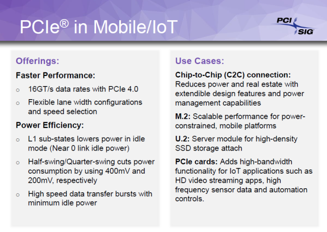
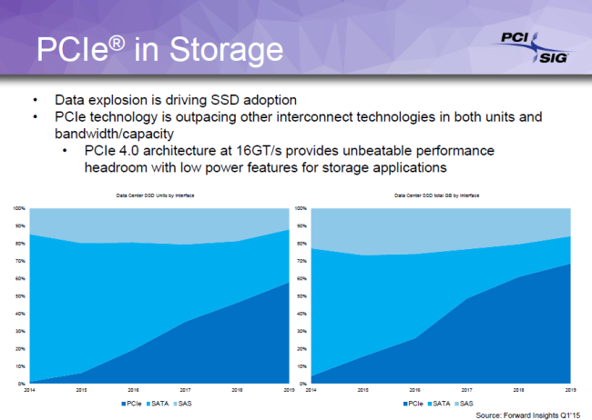

# PCIe Speeds

| V. | Code | Xfer Rate | x1  | x4 | x8 | x16 |
| :--- | :--- | :--- | :--- | :--- | :--- | :--- |

| 1.0 | 8b/10b | 2.5 GT/s | 250 MB/s | 1 GB/s | 2 GB/s | 4 GB/s |
| :--- | :--- | :--- | :--- | :--- | :--- | :--- |

| 2.0 | 8b/10b | 5 GT/s | 500 MB/s | 2 GB/s | 4 GB/s | 8 GB/s |
| :--- | :--- | :--- | :--- | :--- | :--- | :--- |

| 3.0 | 128b/130b | 8 GT/s | 984.6 MB/s | 3.938 GB/s | 7.877 GB/s | 15.754 GB/s |
| :--- | :--- | :--- | :--- | :--- | :--- | :--- |

| 4.0 | 128b/130b | 16 GT/s | 1.969 GB/s | 7.877 GB/s | 15.754 GB/s | 31.508 GB/s |
| :--- | :--- | :--- | :--- | :--- | :--- | :--- |

